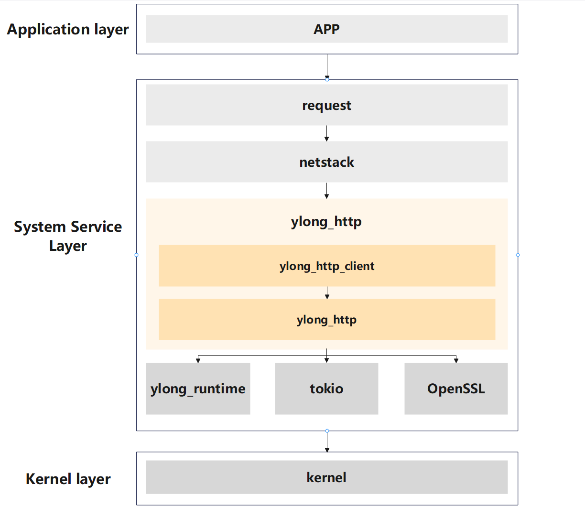
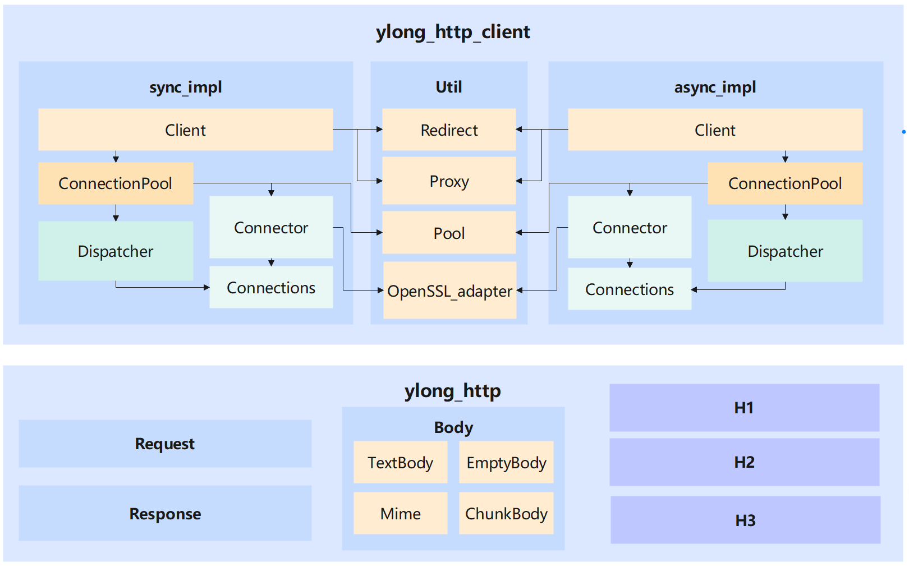

# ylong_http

## Introduction

`ylong_http` has built a complete HTTP capability, supporting users to use HTTP
capability to meet the needs of communication scenarios.

`ylong_http` is written in the Rust language to support OpenHarmony's Rust
capability.

### The position of ylong_http in OpenHarmony

`ylong_http` provides HTTP protocol support to the `netstack` module in the
`OpenHarmony` system service layer, and through the `netstack` module, helps
upper layer applications build HTTP communication capabilities.



The following is the description information for the key fields in the figure above:

- `APP`: A direct user facing upper level application that requires the ability to upload and download.
- `request`: The component in the OpenHarmony system service layer that provides upload and download capabilities.
- `netstack`: The system component in the OpenHarmony system service layer that provides network protocol stack functionality.
- `ylong_http`: The system component in the OpenHarmony system service layer that provides HTTP protocol stack functionality.
    - `ylong_http_client`: One of the modules under `ylong_http` provides HTTP client capabilities.
    - `ylong_http`: One of the modules under `ylong_http` provides the basic components of HTTP.
- `ylong_runtime`: Rust asynchronous runtime library provided by `ylong` in the system service layer.
- `tokio`: The third-party rust asynchronous runtime library commonly used in the industry.
- `OpenSSL`: A commonly used third-party TLS implementation library in the industry.

### The internal structure of ylong_http



The following is the description information for the key fields in the figure above:

- `ylong_http_client`: One of the modules under `ylong_http` provides HTTP client capabilities.
    - `sync_impl`: Synchronize HTTP client implementation without relying on any runtime.
        - `Client`: Synchronize HTTP clients to send HTTP requests.
        - `ConnectionPool`: Manage all `Dispatchers`.
        - `Dispatcher`: Manage the usage rights of `Connections`.
        - `Connector`: Used to create a synchronous connection.
        - `Connections`: Synchronous TCP or TLS connections, etc.
    - `async_impl`: Asynchronous HTTP client implementation.
        - `Client`: Asynchronous HTTP client used to send HTTP requests.
        - `ConnectionPool`: Manage all `Dispatchers`.
        - `Dispatcher`: Manage the usage rights of `Connections`.
        - `Connector`: Used to create an asynchronous connection.
        - `Connections`: Asynchronous TCP or TLS connections, etc.
    - `Util`: Contains common components for both synchronous and asynchronous HTTP client implementations.
        - `Redirect`: HTTP automatic redirection policy.
        - `Proxy`: HTTP proxy policy.
        - `Pool`: Universal Connection pool implementation.
        - `OpenSSL_adapter`: OpenSSL Rust adaptation layer.
- `ylong_http`: One of the modules under `ylong_http` provides the basic components of HTTP.
    - `Request`: HTTP Request implementation.
    - `Response`: HTTP Response implementation.
    - `Body`: HTTP message body implementation.
        - `TextBody`: HTTP message body in plain text.
        - `EmptyBody`: Empty message body implementation.
        - `Mime`: Multipart message body implementation.
        - `ylong_http`: ChunkBody message body implementation.
    - `H1`: HTTP1 related component implementation.
    - `H2`: HTTP2 related component implementation.
    - `H3`: HTTP3 related component implementation.

### ylong_http_client crate

`ylong_http_client` crate supports HTTP client functionality and allows users
to create HTTP clients to send HTTP requests to specified servers.

Abilities supported by the current `ylong_http_client` crate:

- Synchronous and asynchronous HTTP clients.
- HTTP/1.1 and HTTP/2 protocol versions.
- Proxy.
- Redirect.
- Automatic retry.
- Progress callback.
- Connection management and reuse.

### ylong_http crate

`ylong_http` crate provides various basic components of the HTTP protocol, such
as serialization components, compression components, etc. 

Abilities supported by the current `ylong_http` crate:

- Serializer and deserializer of `HTTP/1.1` and `HTTP/2`.
- HPACK implementation.
- Basic types of HTTP Request and HTTP Response.
- Body trait and implementations of bodies.

## Build

`GN` is supported. User should add dependencies in `deps` of `BUILD.gn` to build this crate.

```gn
deps += ["//example_path/ylong_http_client:ylong_http_client"]
```

`Cargo` is supported. User should add dependencies in ```Cargo.toml``` to build this crate.

```toml
[dependencies]
ylong_http_client = { path = "/example_path/ylong_http_client" }
```

## Directory

```text
ylong_http
├── docs                        # User's guide
├── figures                     # Resources
├── patches                     # Patches for ci
├── ylong_http
│   ├── examples                # Examples of ylong_http
│   ├── src                     # Source code ylong_http
│   │   ├── body                # Body trait and body types
│   │   ├── h1                  # HTTP/1.1 components
│   │   ├── h2                  # HTTP/2 components
│   │   ├── h3                  # HTTP/3 components
│   │   ├── huffman             # Huffman
│   │   ├── request             # Request type
│   │   └── response            # Response type
│   └── tests                   # Tests of ylong_http
│
└── ylong_http_client
    ├── examples                # Examples of ylong_http_client
    ├── src                     # Source code of ylong_http_client
    │   ├── async_impl          # Asynchronous client implementation
    │   │   ├── conn            # Asynchronous connection layer
    │   │   ├── downloader      # Asynchronous downloader layer
    │   │   ├── ssl_stream      # Asynchronous TLS layer
    │   │   └── uploader        # Asynchronous uploader layer
    │   ├── sync_impl           # Synchronous client implementation
    │   │   └── conn            # Synchronous connection layer
    │   └── util                # Components of ylong_http_client  
    │       ├── c_openssl       # OpenSSL adapter
    │       │   ├── ffi         # OpenSSL ffi adapter
    │       │   └── ssl         # OpenSSL ssl adapter 
    │       └── config          # Configures
    │           └── tls         # TLS Configures
    │               └── alpn    # ALPN Configures
    └── tests                   # Tests of ylong_http_client
```