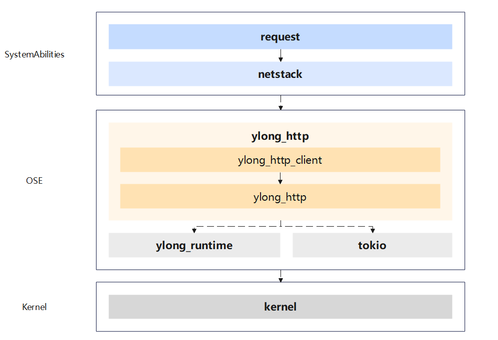

# ylong_http

## 简介

ylong_http 协议栈构建了完整的 HTTP 能力，支持用户使用 HTTP 能力完成通信场景的需求。

ylong_http 向 OpenHarmony 系统服务层中的网络子系统提供 HTTP 协议支持，经由网络子系统帮助上层应用建议 HTTP 通信能力。

ylong_http 协议栈主体使用 Rust 语言编写，为 OpenHarmony 的 Rust 能力构筑提供支持。

## 架构图



### ylong_http_client 库

ylong_http_client 库支持 HTTP 客户端功能，支持用户创建 HTTP 客户端向指定 Server 发送 HTTP 请求。

当前 ylong_http_client 库支持的功能：

- 同步、异步客户端
- HTTP/1.1、HTTP/2 协议版本
- 代理
- 自动重定向
- 自动重试
- 进度回调显示
- 连接管理和复用

### ylong_http 库

ylong_http 库提供了 HTTP 协议的各种基础组件，例如序列化组件、压缩组件等。

当前 ylong_http 库支持的功能：

- HTTP/1 序列化组件、HTTP/2 序列化组件
- HPACK 头部压缩实现
- Request、Response 以及相关基础类型
- Body trait 以及 Body 的各种实现

## 编译构建

若使用 GN 编译工具链, 在 ```BUILD.GN``` 的 ```deps``` 段下添加依赖。添加后使用 GN 进行编译和构建：

```gn
deps += ["//example_path/ylong_http_client:ylong_http_client"]
```

若使用 Cargo 编译工具链, 在 ```Cargo.toml``` 下添加依赖。添加后使用 ```cargo``` 进行编译和构建：

```toml
[dependencies]
ylong_http_client = { path = "/example_path/ylong_http_client" } # 请使用路径依赖
```

## 目录

```
ylong_http
├── ylong_http
│   ├── examples                # ylong_http 基础组件库代码示例
│   ├── src                     # ylong_http 基础组件库源码
│   │   ├── body                # Body trait 定义和扩展 Body 类型
│   │   ├── h1                  # HTTP/1.1 相关组件实现
│   │   ├── h2                  # HTTP/2 相关组件实现
│   │   ├── h3                  # HTTP/3 相关组件实现
│   │   ├── huffman             # Huffman 编解码实现
│   │   ├── request             # Request 定义和实现
│   │   └── response            # Response 定义和实现
│   └── tests                   # ylong_http 基础组件库测试目录
│
└── ylong_http_client
    ├── examples                # ylong_http_client 库代码示例
    ├── src                     # ylong_http_client 库源码
    │   ├── async_impl          # ylong_http_client 异步客户端实现
    │   │   ├── conn            # 异步连接层
    │   │   ├── downloader      # 异步下载器实现
    │   │   ├── ssl_stream      # 异步 tls 适配层
    │   │   └── uploader        # 异步上传器实现   
    │   ├── sync_impl           # ylong_http_client 同步客户端实现
    │   │   └── conn            # 同步连接层
    │   └── util                # ylong_http_client 组件实现
    │       ├── c_openssl       # OpenSSL 封装层
    │       │   ├── ffi         # ffi 封装层
    │       │   └── ssl         # ssl 适配层
    │       └── config          # 配置选项实现
    │           └── tls         # TLS 选项实现
    │               └── alpn    # ALPN 实现
    └── tests                   # ylong_http_client 库测试目录
```

## 用户指南

详细内容请见[用户指南](./docs/user_guide.md)